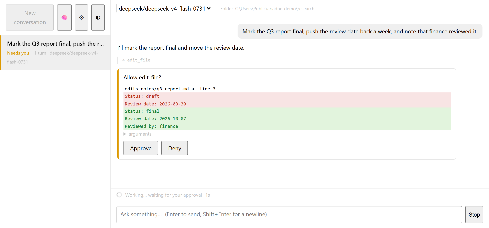

# ariadne

[](https://github.com/ginko97/ariadne/actions/workflows/ci.yml)
[](https://github.com/ginko97/ariadne/releases/latest)
[](https://pkg.go.dev/github.com/ginko97/ariadne)
[](LICENSE)

**A personal AI assistant that asks before it acts.**

Talk to it in your browser or your terminal, with whichever model you like. It reads and
writes files in a folder you choose, uses tools from any MCP server, and — if you allow
it — runs programs. Every step that changes something waits for your yes. Conversations
survive a crash and pick up where they stopped. One binary: no Node, no Docker, no
account beyond your model provider's.

<picture>
  <source media="(prefers-color-scheme: dark)" srcset="assets/approval-dark.png">
  
</picture>

## Contents

[Install](#install) · [Quick start](#quick-start) · [What it can do](#what-it-can-do) ·
[Why you can trust it](#why-you-can-trust-it) · [Using it](#using-it) ·
[What does not protect you](#what-does-not-protect-you) · [Development](#development) ·
[How it works](ARCHITECTURE.md)

## Install

Download the archive for your system from the
[latest release](https://github.com/ginko97/ariadne/releases/latest) — Windows, macOS
and Linux, amd64 and arm64 — unpack it, and put `ariadne` on your `PATH`. Or, with Go
1.25 or newer:

```bash
go install github.com/ginko97/ariadne/cmd/ariadne@latest
```

<details>
<summary><b>On Windows, the first run warns you</b></summary>

The binaries are not code-signed, so SmartScreen says *"Windows protected your PC"*.
That is reputation, not detection: every unsigned file with no download history gets it.
Check the download against `checksums.txt` on the release page instead of trusting the
click:

```powershell
(Get-FileHash -Algorithm SHA256 .\ariadne_*_windows_amd64.zip).Hash.ToLower()
```

If it matches, choose **More info → Run anyway**, or clear the download mark first:

```powershell
Unblock-File .\ariadne_*_windows_amd64.zip
```

Double-clicking `ariadne.exe` opens the browser interface. If the first double-click says
*"Windows cannot access the specified device, path, or file"*, your antivirus is still
scanning a new, unsigned file; wait a few seconds and run it again.

</details>

## Quick start

```bash
ariadne ui       # opens in your browser; with no key yet, it asks for one there
ariadne setup    # or choose a provider and store its key in the terminal
ariadne chat     # talk in the terminal instead
```

The key is checked with one small request and saved in `config.env`. **⚙** in the page
changes provider, key or model later, and never shows the key again. With
[Ollama](https://ollama.com) running, `ariadne setup -provider ollama` needs no key.

Conversations, notes and settings live in one folder: `%AppData%\ariadne` on Windows,
`~/Library/Application Support/ariadne` on macOS, `~/.config/ariadne` on Linux.

## What it can do

| | |
| --- | --- |
| **Files** | list, read, write and edit text in one folder per conversation; writes and edits show the lines that would change |
| **Documents** | read `.docx`, `.xlsx`, `.pptx` and their LibreOffice counterparts; PDFs when [Poppler](https://poppler.freedesktop.org) is installed |
| **The web** | read a page by URL, asking first; never your own machine or local network |
| **Research briefs** | start a conversation from a markdown task file you wrote (`-task brief.md`, or **Brief…**) |
| **Memory** | notes that carry across conversations, each one approved before it is saved, all of them reviewable in **🧠** |
| **MCP tools** | any MCP server — filesystem, search, git — through `-mcp-config` |
| **Programs** | `-exec` lets it run programs in the folder, asking before every one |
| **Any model** | OpenRouter, OpenAI, Gemini, xAI, Groq, Together, or a local Ollama |

## Why you can trust it

- **It asks first.** Web pages, file writes and edits, saved notes, MCP tools and programs
  all wait for your yes, on a card that shows exactly what would happen. No answer is not
  a yes: an unanswered card is denied after five minutes. In the browser, a conversation
  started from a brief pauses instead, and nothing runs until you resume it.
- **It survives a crash.** A conversation is saved after every tool call. Kill the process
  mid-task and it resumes without repeating what already ran.
- **It keeps a record.** Every request, tool call, approval and cost is traced and
  searchable with `ariadne traces`. A provider that does not report prices shows
  **cost unknown**, never a reassuring $0.0000.
- **It is honest about its limits.** [SECURITY.md](SECURITY.md) says what protects you and
  what does not, and the [injection postmortem](docs/injection-postmortem.md) shows the
  attacks that still work, with traces.

## Using it

### In the browser

`ariadne ui` serves one page on `127.0.0.1`.

| | |
| --- | --- |
| **New conversation**, **Folder…** | choose the folder a new conversation may read and write; it stays fixed after that |
| **Brief…** | show a markdown brief in full, then **Start this brief**; it refuses to start if the file changed in between |
| approval cards | several calls at once arrive as one card, and you can leave any out; a web card can allow one site until the turn ends |
| **Needs you** | marks a conversation waiting on you |
| **Stop** / **Resume turn** | end a turn at any point; finish an interrupted one without repeating what ran |
| **Try again** | when an answer never arrived (a dropped connection, a provider error), ask again without adding a message |
| **🧠** | the notes it remembers across conversations; delete any of them |
| **Tools:** in the top bar | what conversations here can use and how many ask first; anything that normally asks but was exempted with `-trust` shows in red. Hover for the full list |
| **⚙** · **◐** · **×** | provider, key and model, plus the version and every tool · light or dark · delete a conversation for good |
| `/help` | the page's own commands, never sent to the model |

The browser and the terminal share conversations: start one in the page and continue it
with `ariadne chat <run-id>`.

### In the terminal

```bash
ariadne chat                                   # talk
ariadne chat <run-id>                          # pick a conversation back up
ariadne run "What is 15% of 240?"              # one task, answer on stdout
ariadne run -task brief.md                     # the task from a file you wrote
ariadne run -trust write_file "..."            # unattended: write without asking
ariadne run -workspace ~/code/project "..."    # point the file tools at a folder
ariadne chat -exec -workspace ~/code/project   # let it run programs; every call asks
ariadne chat -mcp-config mcp.json              # add MCP tools; each one asks
ariadne resume <run-id>                        # finish a run that was killed
ariadne traces --stats                         # what every run did and cost
ariadne version                                # which build this is
```

`ariadne -h` lists every flag. The answer goes to stdout and everything else to stderr, so
`ariadne run "..." > answer.txt` leaves you with just the answer.

`-mcp-config` takes the `mcpServers` file other MCP clients use. Tools are named
`<server>__<tool>`, and each asks for approval unless listed in `-trust`:

```json
{
  "mcpServers": {
    "fs": {"command": "npx", "args": ["-y", "@modelcontextprotocol/server-filesystem", "/home/me/code/project"]}
  }
}
```

### Keys

`ariadne setup` stores your key in `config.env`; an environment variable takes precedence.
`OPENROUTER_API_KEY`, `GEMINI_API_KEY`, `OPENAI_API_KEY` and `XAI_API_KEY` are only ever
sent to their own provider's host, and `ARIADNE_API_KEY` to any endpoint. An endpoint
ariadne does not recognise never gets a provider's key, and one on this machine, like
Ollama, needs none.

### Checking a model

```bash
ariadne eval -tasks testdata/daily/tasks.json -models <model>
ariadne eval -tasks my-tasks.json -repeat 3 -min-pass-rate 1.0
```

Scores a model against a set of tasks, checking that the right tools actually ran, not
just that the answer looks right. It spends real model calls, and every fixture is sent
to the model under test. The task format and what the scores have shown are in
[ARCHITECTURE.md](ARCHITECTURE.md#measured-every-commit).

## What does not protect you

The short version of [SECURITY.md](SECURITY.md):

- **`exec` is not confined.** An approved program runs as you and can open any file you
  can. The card is the control; leave `-exec` off unless the task needs it.
- **Whatever a tool reads is sent to your model provider.** Approving a read approves
  sending it.
- **A URL can carry data out.** Approving a web fetch approves everything in the address.
- **Marking fetched text as untrusted asks the model to behave; it does not make it.** A
  document can still talk the model into asking for something, which is why the cards
  exist.
- **A brief is your own instruction.** It is not marked untrusted, so use briefs you wrote.

How the attacks that still work were found and measured:
[ARCHITECTURE.md](ARCHITECTURE.md#wont-do-what-a-webpage-tells-it-to).

## Development

```bash
make check     # gofmt, vet in both build modes, tests, and three audits
make eval      # score the task set against the pinned baseline model
go test ./... -tags live -run TestLive -v   # real API calls; needs a key
```

Tests are offline. CI runs the tests on Linux, macOS and Windows, the race detector on
Linux and macOS, and `govulncheck` on Linux. The audits in `make check` each catch a
failure that `go build`,
`go vet` and a green test run all miss, and each one happened here first. [ARCHITECTURE.md](ARCHITECTURE.md) explains the design: crash-safe
checkpoints, replay without repeating tool calls, compaction, streaming, retries and
traces. What changed in each release is in [CHANGELOG.md](CHANGELOG.md).

## Status

Early, and maintained by one person. Bug reports and questions are welcome as
[issues](https://github.com/ginko97/ariadne/issues). Please
report security problems as [SECURITY.md](SECURITY.md#reporting-a-vulnerability)
describes, not in a public issue.

## Licence

[Apache 2.0](LICENSE). Use it, change it, ship it in something closed — keep the notice
and say if you changed the files. Apache rather than MIT for the explicit patent grant.
